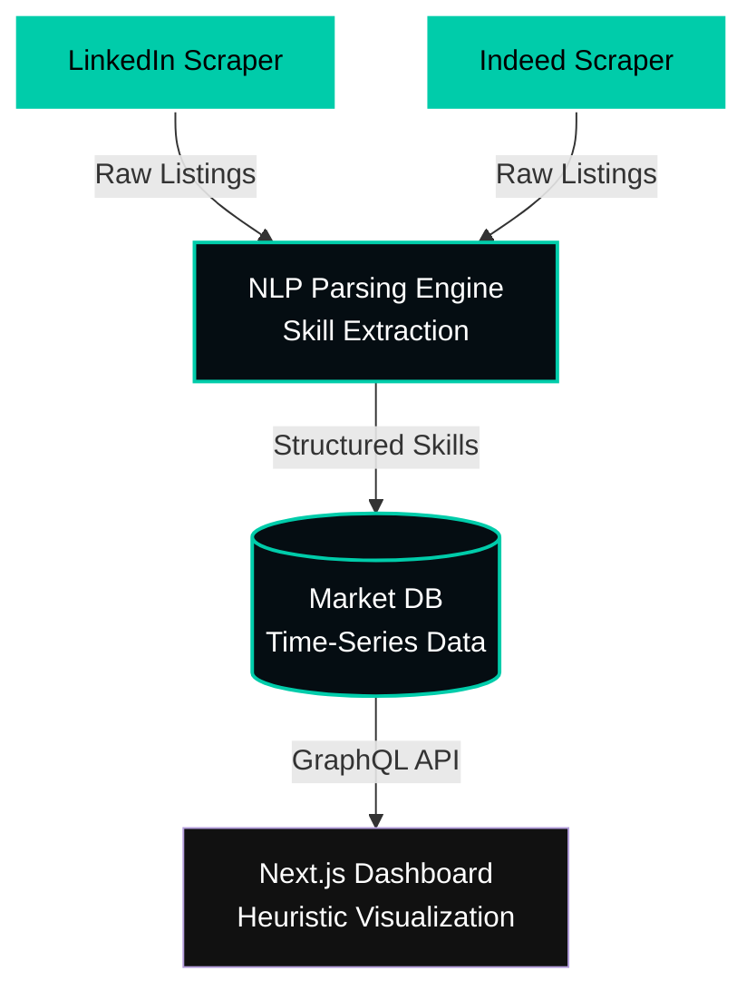

  

  
  

## 📊 Overview
**AI Job Market Intelligence** is an advanced platform featuring heuristic trend forecasting and career strategic intelligence. It tracks demand, skill requirements, and geographic trends in the AI engineering job market.

---

## 📐 System Architecture Demo

The intelligence platform ingests data from multiple tech job boards, analyzes it through a NLP pipeline, and visualizes the heuristics on a dynamic dashboard.

### 🧠 Analytics Pipeline Demonstration
1. **Data Ingestion:** Automated scraping agents collect thousands of AI job listings daily.
2. **Processing:** The NLP Engine extracts core skills (e.g., "PyTorch", "LLMOps", "RAG") and normalizes job titles.
3. **Forecasting:** Heuristic algorithms predict the rise and fall of specific technology requirements over the next 12-24 months.

---

## ⚡ Key Features
- **Skill Demand Forecasting:** Identify which AI skills are trending up.
- **Salary Band Analytics:** Aggregated salary data based on location and seniority.
- **Automated Data Pipelines:** Built for reliability and continuous intelligence gathering.

## 🗺️ Roadmap
- [x] Standardize repository branding and architecture diagrams.
- [ ] Add real-time streaming to the Next.js dashboard.
- [ ] Implement deeper integration with Anthropic Claude for job description summarization.

---
**Innovative. Performant. Sovereign.**
*Built by Koketso Raphasha (Raphasha27)*
