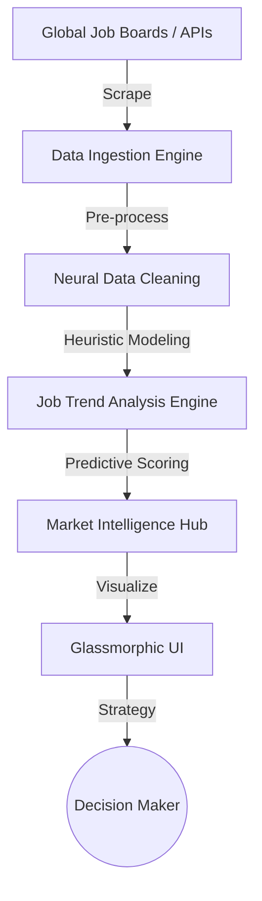

# 🏛️ KIROV DYNAMICS | AI JOB MARKET INTELLIGENCE

📊 **Agentic Insights for the Future of Work**

[](https://github.com/Raphasha27)
[](https://github.com/Raphasha27/Health-Hub)

> **"Mapping the Neural Landscape of Global Employment."**

---

## 📖 Overview

**AI Job Market Intelligence** is a high-fidelity analytics platform designed to track, analyze, and predict trends in the global AI and technology job markets. By scraping real-time data and applying heuristic modeling, it provides a strategic "Command Center" for career planning and institutional labor analysis.

---

## 🏗️ Architecture & Pipeline

The system operates a continuous data-ingestion and analysis pipeline.



---

## ✨ Features

- **📊 Real-time Trend Analysis**: Tracks the rise and fall of specific AI skills (e.g., LLM Engineering, Neural Architecture) in the global market.
- **🗺️ Geographic Heatmaps**: Visualizes high-growth tech hubs across South Africa and the globe.
- **🤖 Skill Gap Forecasting**: Uses Gemini-powered insights to predict which skills will be in highest demand in the next 18-24 months.
- **🛡️ Sovereign Security**: Hardened via Health-Hub for autonomous status integrity and zero-noise CI/CD.

---

## 🛠️ Technology Stack

| Layer | Technology |
| :--- | :--- |
| **Backend** | Python / FastAPI (Heuristic Modeling) |
| **Frontend** | React / Next.js (Glassmorphic Dashboard) |
| **Intelligence** | Google Gemini (Trend Forecasting) |
| **Hardening** | Kirov Health-Hub Status Injection |

---

## 🚀 Getting Started

```bash
# Clone the repository
git clone https://github.com/Raphasha27/ai-job-market-intelligence.git

# Launch the Intelligence Hub
cd backend && pip install -r requirements.txt && uvicorn main:app
cd frontend && npm install && npm run dev
```

---

## 📜 License
MIT

---
*Architected and Engineered by Raphasha27 - Kirov Dynamics 2026.*
